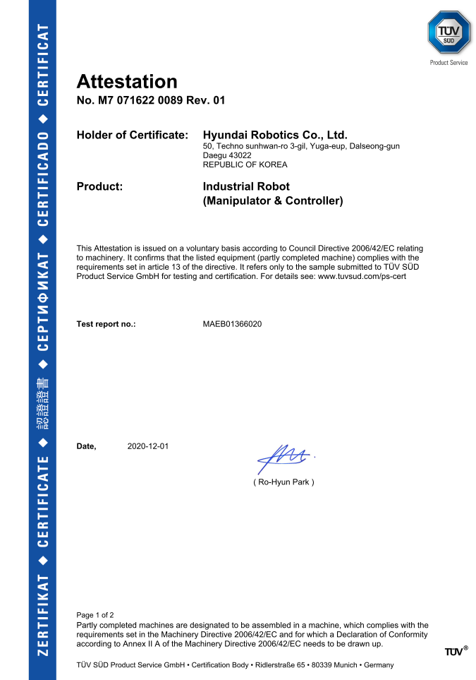
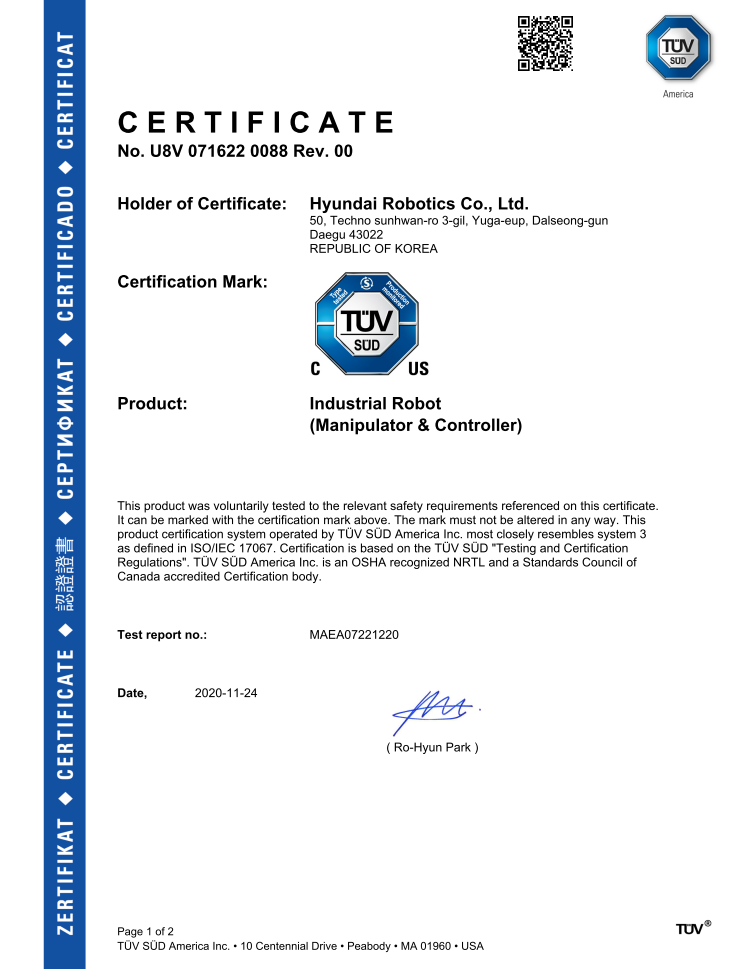
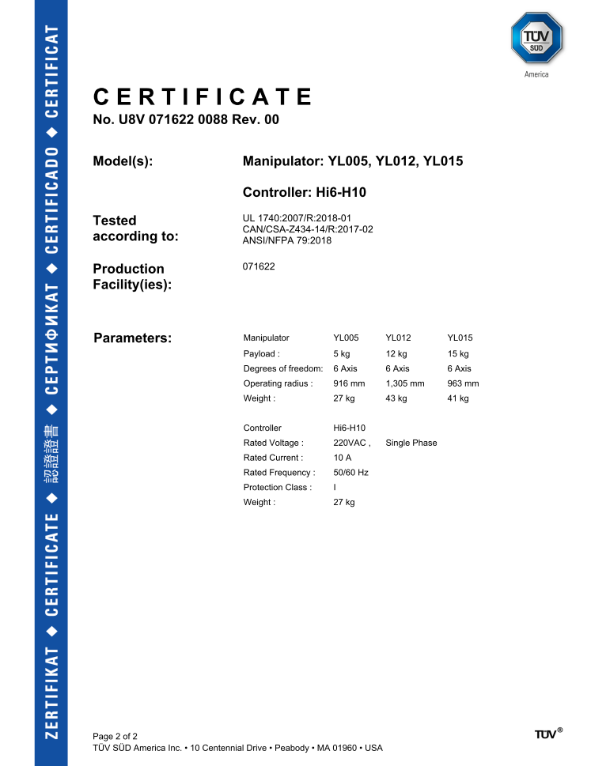
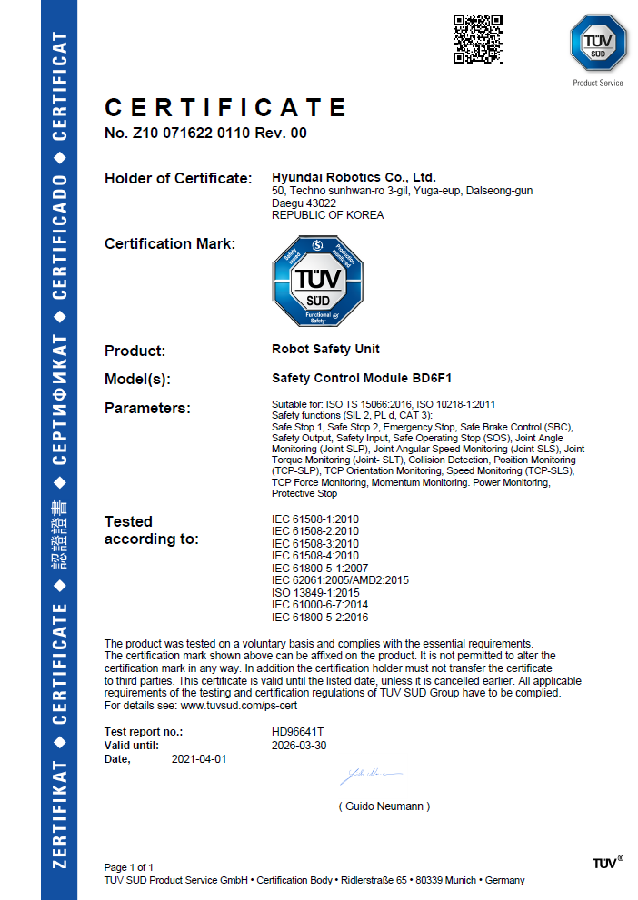
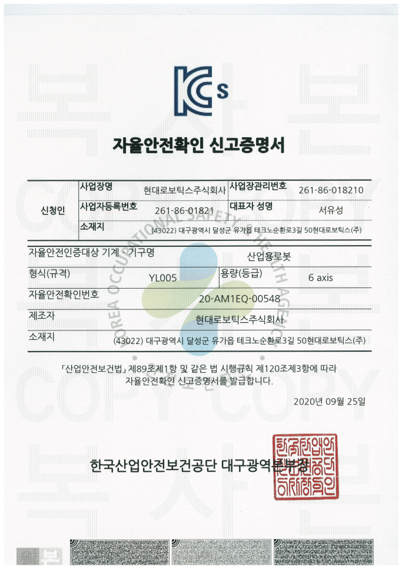
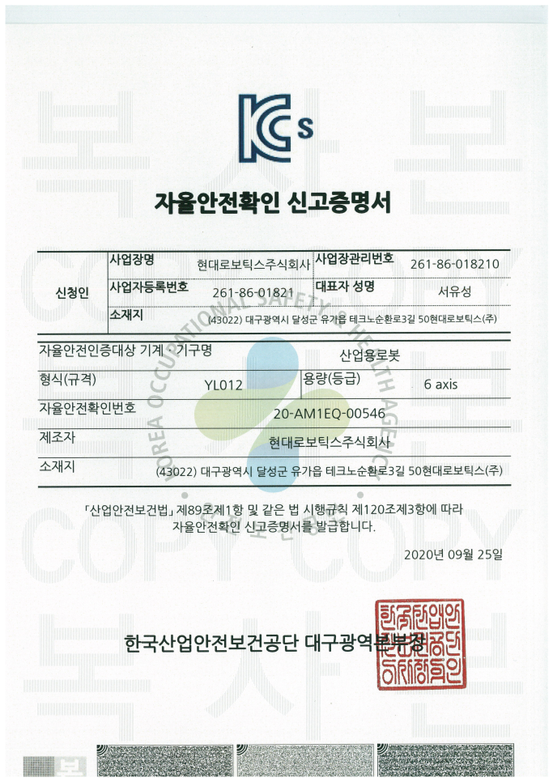
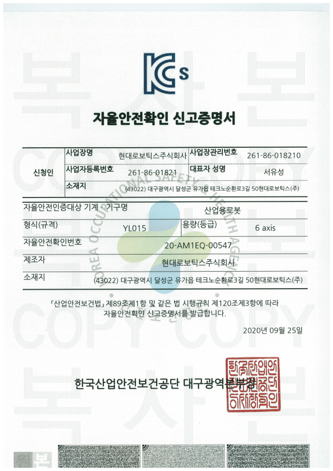

# Certifications

Hyundai Robotics acquired certificates of the robot from the following official testing and certification bodies for supplying stable robot systems:

## <mark style="color:green;">CE Certifications</mark>

## <mark style="color:green;">NRTL Certifications</mark>

## <mark style="color:green;">Autonomous safety verification reporting certificate(KCs) (YL005)</mark>

## <mark style="color:green;">Autonomous safety verification reporting certificate(KCs) (YL012)</mark>

## <mark style="color:green;">Autonomous safety verification reporting certificate(KCs) (YL015)</mark>

## <mark style="color:green;">Functional Safety certificate</mark>

